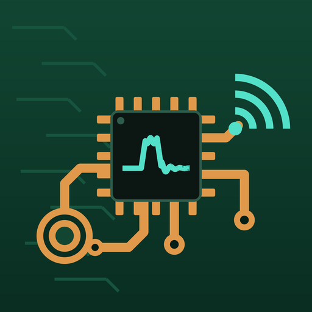

<p align="center"></p>

# ElectroBoard

**Simulador móvil para aprender a diseñar sistemas electrónicos inteligentes.**
El estudiante elige sensor, controlador, actuador, comunicación, alimentación y lógica; el simulador prueba el sistema completo frente a condiciones reales y un evaluador de reglas explica cada acierto y cada error.

Ingeniería Electrónica · Sistemas embebidos · IoT · Automatización
Aplicación del proyecto *Educational Mobile Apps Factory*.

---

## Qué ofrece

| | |
|---|---|
| **6 proyectos** | Incubadora (Arequipa), aula con CO₂ (Huancayo), tanque elevado (Lima), riego autónomo (Huaral), faja minera (Pasco), cadena de frío de vacunas (Cusco) |
| **Tablero de bloques** | 55 componentes con datos de hoja técnica y precios referenciales en soles |
| **Lógica y firmware** | Encendido/apagado, histéresis, proporcional, PID y disparo con enclavamiento; firmware bloqueante, no bloqueante o RTOS; reenvío y bajo consumo |
| **Simulación** | Planta física, sensor con sesgo, ruido y retardo, enlace con pérdidas y cortes, energía y autonomía; osciloscopio con reproducción |
| **Evaluador de diseño** | 60 reglas deterministas, rúbrica de 6 dimensiones, 3 competencias y la lección que explica cada hallazgo |
| **Firmware generado** | Esqueleto Arduino/C++ (o Python en Raspberry Pi) que refleja cada decisión del diseño |
| **5 módulos** | Arquitectura embebida, Sensores, Actuadores y control, Comunicación, IoT: 25 lecciones con pregunta de control |
| **Bitácora** | Intentos, competencias y evolución por proyecto, guardados solo en el teléfono |

Funciona sin conexión. No requiere cuenta.

## Obtener el APK

### Opción A · GitHub Actions (recomendada)

1. Crea un repositorio vacío en GitHub y sube este proyecto:
   ```bash
   git remote add origin https://github.com/<usuario>/electroboard.git
   git push -u origin main
   ```
2. En la pestaña **Actions**, el flujo **CI** valida el contenido, analiza el código, corre las pruebas y compila el APK.
3. Descarga el artefacto **electroboard-apk** del resumen de la ejecución.
4. Para publicar una versión con el APK adjunto: `git tag v1.0.0 && git push origin v1.0.0`.

### Opción B · Compilación local

Requisitos: Flutter 3.24.5 (Dart 3.5), JDK 17 y Android SDK.

```bash
flutter pub get
bash scripts/prepare_android.sh   # genera android/, fija el nombre y crea los íconos
flutter build apk --release
# APK: build/app/outputs/flutter-apk/app-release.apk
```

## Desarrollo

```bash
flutter pub get
flutter analyze --no-fatal-infos
flutter test
python3 tools/validate_content.py         # integridad del contenido
python3 tools/reference_engine.py         # informe de calibración del motor
python3 tools/check_imports.py            # imports y símbolos (sin SDK de Dart)
python3 tools/check_calls.py              # argumentos de constructores
```

## Estructura

```
electroboard/
├── assets/
│   ├── data/            components · missions · modules · findings (JSON)
│   └── icon/            ícono clásico, adaptable y vista previa
├── lib/
│   ├── app/             MaterialApp y tema «placa de circuito»
│   ├── core/            formato en español
│   ├── domain/          modelos · motor (cableado, simulación) · evaluador · generador de firmware
│   ├── data/            fuentes JSON y repositorios (contenido y avance)
│   └── presentation/    providers · ViewModels · vistas · widgets dibujados con CustomPainter
├── test/                dominio, contenido, datos, ViewModels, widgets y paridad con Python
├── tools/               motor de referencia, validadores, generador del ícono
├── scripts/             preparación de Android
├── docs/                análisis, arquitectura, motor, diseño educativo, guía docente
└── .github/workflows/   CI/CD
```

**Arquitectura:** MVVM con Riverpod y Repository Pattern. El dominio es Dart puro, sin Flutter. Detalle en [`docs/ARQUITECTURA.md`](docs/ARQUITECTURA.md).

## Calidad

| Verificación | Alcance |
|---|---|
| Pruebas de Dart | 85 pruebas declaradas + 86 casos de paridad con el motor de Python |
| Paridad | Cada proyecto: solución de referencia y hasta 22 variantes con errores típicos |
| Contenido | Referencias cruzadas, preguntas de control, textos de las 60 reglas |
| Ortografía | Prueba de palabras técnicas con tilde sobre todo el texto visible |
| CI | Contenido → análisis y pruebas → APK → publicación al etiquetar |

## Documentación

- [`docs/ANALISIS_Y_DECISIONES.md`](docs/ANALISIS_Y_DECISIONES.md) · diagnóstico crítico, decisión sobre IA y alcance
- [`docs/DISENO_EDUCATIVO.md`](docs/DISENO_EDUCATIVO.md) · competencias, recorrido y proyectos
- [`docs/MOTOR_Y_EVALUADOR.md`](docs/MOTOR_Y_EVALUADOR.md) · modelo, métricas, reglas y límites
- [`docs/ARQUITECTURA.md`](docs/ARQUITECTURA.md) · capas, MVVM, repositorios y flujo
- [`docs/GUIA_DOCENTE.md`](docs/GUIA_DOCENTE.md) · uso en clase y edición del contenido

## Sobre el evaluador

El evaluador **no usa un modelo de lenguaje**. Aplica reglas deterministas sobre el diseño y sobre la simulación: el mismo diseño recibe siempre el mismo informe y cada hallazgo cita el valor que lo activó. Un asistente conversacional queda para la versión 2.0, con el simulador como árbitro de cualquier cifra.

## Límites declarados

La planta usa dinámica de primer orden, los enlaces se modelan estadísticamente y los precios son referenciales. ElectroBoard sirve para **comparar decisiones de diseño**, no para dimensionar un equipo real. El firmware generado es un esqueleto didáctico.
